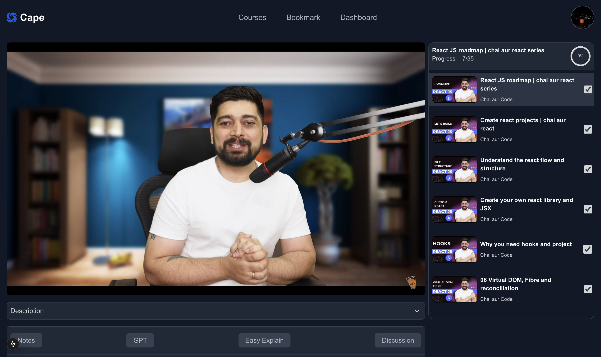
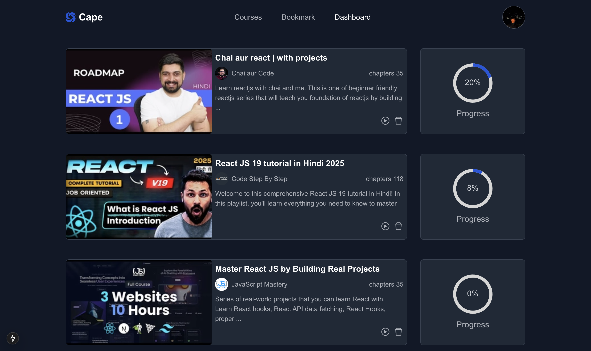
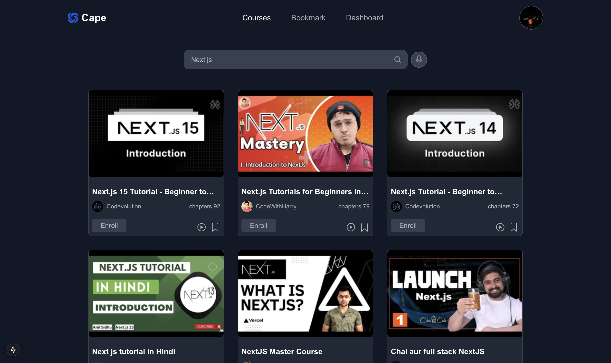

# Cape

Cape makes learning from YouTube effortless and distraction-free. Track your progress with daily streaks, take notes using the integrated Notion editor, and get playlist-specific help with a built-in AI chatbot.

## Demo

[Video Link](https://player.vimeo.com/video/1091094086?h=2e3d4ca95a)

## Screenshots

## Tech Stack

#### Frontend

- [Next.js](https://nextjs.org/)
- [Typescript](https://www.typescriptlang.org/)
- [TailwindCSS](https://tailwindcss.com/)
- [Block Notes](https://www.blocknotejs.org/)
- [YouTube API](https://developers.google.com/youtube/v3/getting-started)
- [DeepSeek API](https://api-docs.deepseek.com/)

#### Backend

- [Express.js](https://www.npmjs.com/package/express)
- [Mongoose](https://mongoosejs.com/)
- [JavaScript](https://www.javascript.com/)

#### Database

- [MongoDB](https://www.mongodb.com/)

# Folder Structure

<pre><code>
|---client
|   |
|   |---app
|   |   |---api
|   |   |   |---auth
|   |   |       |---[...nextauth]
|   |   |          |---route.ts
|   |   |---bookmark
|   |   |   |---layout.tsx
|   |   |   |---page.tsx
|   |   |---components
|   |   |   |---CourseCard.tsx
|   |   |   |---Editor.tsx
|   |   |   |---EnrolledCard.tsx
|   |   |   |---Header.tsx
|   |   |   |---NavBar.tsx
|   |   |   |---NotesGpt.tsx
|   |   |   |---PlaylistVideoCard.tsx
|   |   |   |---PopularCourses.tsx
|   |   |   |---sessionProvider.tsx
|   |   |---course
|   |   |   |---[id]
|   |   |       |---[videoId]
|   |   |           |---layout.tsx
|   |   |           |---page.tsx
|   |   |---courses
|   |   |   |---layout.tsx
|   |   |   |---page.tsx
|   |   |---dashboard
|   |   |   |---layout.tsx
|   |   |   |---page.tsx
|   |   |---home
|   |   |   |---page.tsx
|   |   |---redux
|   |   |   |---slices
|   |   |   |   |---chapterHandleSlice.ts
|   |   |   |   |---checkboxSlice.ts
|   |   |   |   |---playlistSlice.ts
|   |   |   |---provider.tsx
|   |   |   |---store.ts
|   |   |---utils
|   |       |---apiCalls.ts
|   |---public
|   |---types
|---server
|   |---connection
|   |   |---dbConnections.js
|   |---controller
|   |   |---auth.js
|   |   |---bookmarkCourse.js
|   |   |---chat.js
|   |   |---discussion.js
|   |   |---enrolledCourse.js
|   |   |---notes.js
|   |---middleware
|   |---models
|   |   |---bookmarkCourse.js
|   |   |---chat.js
|   |   |---discussion.js
|   |   |---enrolledCourse.js
|   |   |---notes.js
|   |   |---user.js
|   |---router
|   |   |---auth.js
|   |   |---bookmarkCourse.js
|   |   |---chat.js
|   |   |---discussion.js
|   |   |---enrolledCourse.js
|   |   |---notes.js
|   |---service
|   |   |---auth.js
|   |---.env
|   |---index.js
|---README.md
</code></pre>

# Configuration and running the Project

## Clone the project

<pre>
    git clone `https://github.com/anuprajvarma/cape.git`
    cd client & cd server
</pre>

## client

<pre>
    npm install

Set Envirement Variable

    NEXT_PUBLIC_GOOGLE_CLIENT_ID=your_google_client_id
    NEXT_PUBLIC_GOOGLE_CLIENT_SECRET=your_google_client_secret
    NEXT_PUBLIC_NEXTAUTH_SECRET=random_strong_string
    NEXT_PUBLIC_NEXTAUTH_URL=where_your_project_run || http://localhost:3000
    NEXT_PUBLIC_YOUTUBE_API_KEY=youtube_api_key
    NEXT_PUBLIC_HUGGINGFACE_API_KEY=deepseek_api_key

run project

    npm run dev    
</pre>

## server

<pre>
    npm install

Set Envirement Variable

    PORT=set_your_port || 5002

run project

    npm start    
</pre>
